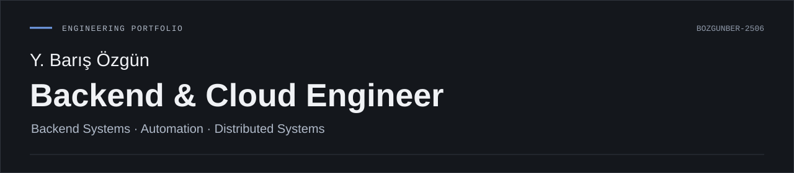
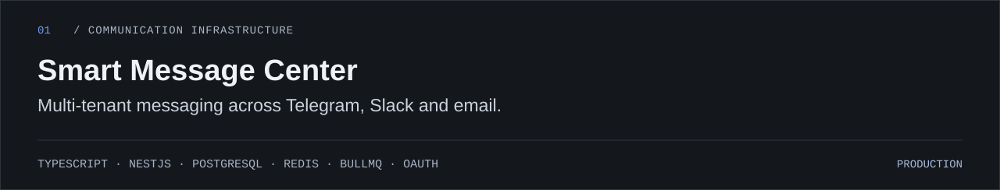
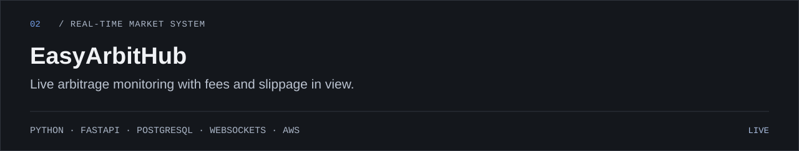
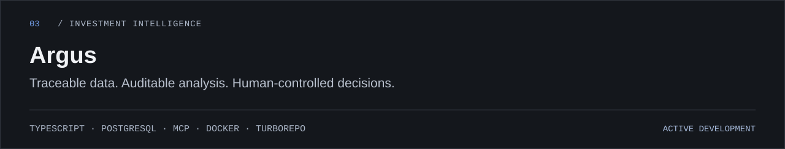
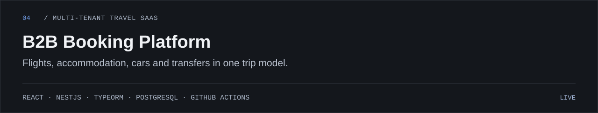

I build production-oriented backend systems, automation platforms and multi-tenant SaaS with a focus on reliability, explicit failure handling and maintainable architecture.

My background in long-running business operations shapes how I design software for real users, external dependencies and production constraints.

[Website](https://thebozgun.com/) · [LinkedIn](https://www.linkedin.com/in/the-bozgun/) · [GitHub](https://github.com/BozgunBer-2506)

## Selected Systems

[Repository ↗](https://github.com/BozgunBer-2506/smartmc)

[Live ↗](https://easyarbithub.com/)

[Live ↗](https://terrific-respect-production-6ef7.up.railway.app/)

## Engineering Profile

Reliability at integration boundaries, tenant isolation, idempotent processing and data integrity guide my architecture decisions.

| Area | Technologies & practices |
| :--- | :--- |
| Backend | TypeScript · Node.js · NestJS · Python · FastAPI · Go · PHP |
| Data | PostgreSQL · Redis · SQLite · Prisma · TypeORM · SQLAlchemy |
| Cloud & Delivery | AWS · Docker · Kubernetes · GitHub Actions · Nginx · Railway · Vercel · Cloudflare |
| Integration & Automation | OAuth · Webhooks · MCP · REST APIs · WebSockets · n8n |
| Architecture | Multi-tenancy · Event-driven systems · RBAC · Idempotency · Background jobs · External integrations |
| E-Commerce | Shopware 6 · WooCommerce · Symfony · WordPress |

## Additional Work

- **Headless Shopware 6 Commerce** German B2C commerce with payment and shipping integrations and a decoupled React storefront. Shopware 6 · PHP · Symfony · React · PayPal · DHL.
- **[Travaliz](https://travaliz.com/)** Go-based travel search integrating travel inventory through the Amadeus API.
- **[Techslex](https://techslex.com/)** Software marketplace.
- **FastAPI Order Management** Order management API with PostgreSQL persistence.
- **Technical guides** [AWS](https://aws-cloud-rehberi-tr.vercel.app/), [Linux](https://linux-rehberi-tr.vercel.app/), [Python](https://python-rehberi-tr.vercel.app/) and [Docker](https://docker-rehberi-tr.vercel.app/).

## Credentials

- AWS Certified Cloud Practitioner (CLF-C02)
- IHK Fachinformatiker / IT-Administrator
- IHK IT Support Specialist
- IHK Cloud Business Expert
- Linux Essentials
- Syntax-Institut · Agile Software Developer & Cloud Engineering

---

Backend systems, cloud engineering and thoughtful automation. [Get in touch](https://www.linkedin.com/in/the-bozgun/).
